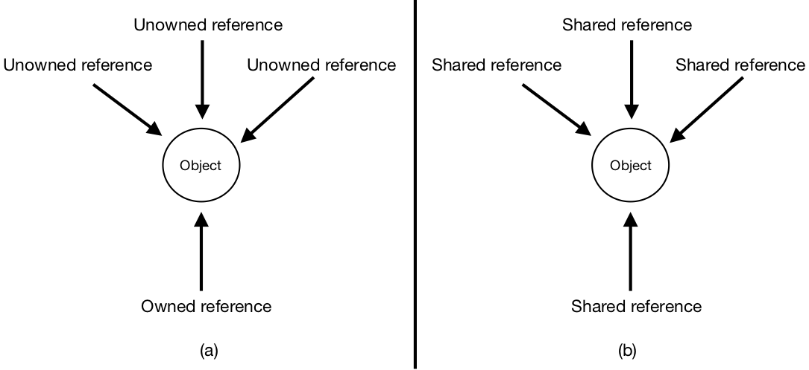

Ownership -- Introduction
=============================================================

.. highlight:: Solidity

Solidity is object-oriented. It includes *contracts*, which are like classes, and can have *fields* 
and *functions*, analogous to Java fields and methods respectively. 

In order to use Solidity effectively, we suggest applying *ownership* to clarify the relationships between objects. In this section of the tutorial, you will learn about ownership.

Objects can be *owned*, in which *one of the references* to the object is owned. An owned object can have any number of unowned references. Alternatively, if the object is not owned, 
it can have any number of shared references (shown in *(b)* below). An object with shared references can also have unowned references,
but not owned ones.

In other words, the concept of ownership is having different types of references to an object. There are three different 
types of references: owned, unowned, and shared.
Let's use money as an example. If you have $10, that money belongs to you -- you own it. This is the idea of an owned reference.
You can show this money to anyone else; they can see the money, and talk about it, but they can't do anything with it -- 
they can't spend it or save it because it's not theirs. This is the idea of an unowned reference; it's a reference to an object,
but doesn't have as much manipulative power over the object because it doesn't own the object. Now imagine the $10 is in a public pot that anyone can take from. 
In this case, everyone shares ownership of the money; i.e., you all have shared references to it. Shared references might reflect how you are accustomed to thinking about references.

*Note that ownership ONLY applies to objects; primitive types (like ints, strings, booleans, etc.) do NOT have permissions.*

Continuing with money, here is an example of a contract (a ``Wallet``) with an object, a ``Money`` contract, 
that has one owned reference:

::

   pragma solidity ^0.5.1;

   contract Money {
   }

   contract Wallet {
      Money m; // m is owned

      function spendMoney() public {
         ...
      }
   }

In Solidity, we can use comments to indicate ownership. Note that with this code alone, ``m`` is an owned reference that doesn't actually point to any object. If we wanted to create a new object,
we would do it in a similar way to other object-oriented languages: ``m = new Money()``. Now, ``m`` is an owned reference pointing to a 
``Money`` object.

- If a reference is the only one that holds ownership, then it is owned.
- If all references to the object are the same (there is no owner), then each reference is shared.
- If a reference is NOT the owning one, but there might be another owning reference, then the reference is unowned.

