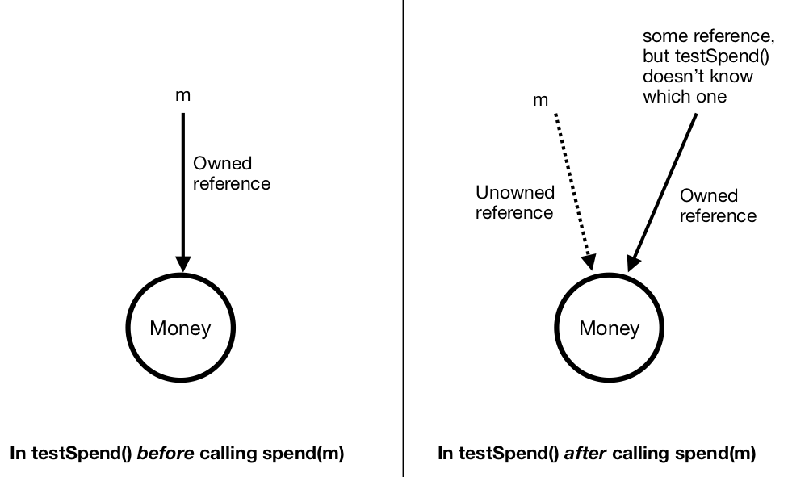

Ownership -- Transactions
=============================================================

  
Transaction return types
------------------------

When transactions return objects, the type of the returned object must be annotated in the transaction declaration. For example:

::

   transaction withdraw() returns Money@Owned {
      // body not shown
      return m; //where m is of type Money@Owned
   }

If we did not return ``m`` within the transaction, or if ``m`` was not of type ``Money@Owned``, we would get an error.

Transaction parameters
------------------------
Unlike in traditional programming languages, in Obsidian, the type of a variable can *change*: ownership is part of types, and ownership can change as operations occur. When a reference is passed to a transaction as an argument, the transaction's declaration specifies initial and final ownership with ``>>``. 
If ``>>`` is not specified for a certain parameter, then the ownership of that parameter *doesn't change*. For example:

::

   // m is Owned initially but must be Unowned at the end.
   // A caller of spend() must initially own the parameter to spend(), but after 
   //   the call returns, the caller no longer owns it (hence the name `spend`).
   transaction spend(Money@Owned >> Unowned m) {
      // implementation not shown
   };

   transaction testSpend() {
      Money m = ...; // Assume that m is an owning reference.
      spend(m);
      // m is now of type Money@Unowned because spend() took ownership.
   }

   transaction foo(Money@Owned m) { //this is the equivalent to Money@Owned >> Owned m
      // body not shown
   }

The figure below shows how `m` is an owned reference before `spend()` is called, but afterward, `m` is no longer an owner. The code above doesn't specify which reference is the new owner, since we can't see the implementation of `spend()`.

If a transaction expects an argument that is ``Unowned``, this means that the transaction cannot take ownership. 
As a result, it is safe to pass an ``Owned`` reference as an argument to a transaction that expects an ``Unowned`` argument. 
After the transaction returns, the caller still holds ownership. For example:

::

   transaction logMoney(Money@Unowned m) {
      ...
   }

   transaction callLogMoney(Money@Owned m) {
      logMoney(m);
      // OK; m is still an Owned reference.
   }

Transaction receivers (``this``)
---------------------------------
Sometimes the ownership of ``this`` (the ownership of this contract) needs to change in a transaction. 
That can be specified by adding ``this`` as the first argument in the transaction declaration. Note that ``this`` is implicit,
and is not an actual parameter. For example:

::

   contract Money {
      transaction discard(Money@Owned >> Unowned this) {
         // implementation not shown
      }
   }

   contract Wallet {
      transaction throwAwayMoney(Money@Owned >> Unowned money) {
         money.discard(); // 'this' argument is implicit; do not include it in transaction call.
      }
   }
