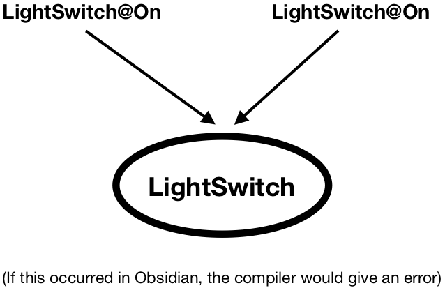

States -- Introduction
=======================

In our new programming language, contracts can define *states*. For example, a ``LightSwitch`` is always  either ``Off`` or ``On`` (never both):

::

   contract LightSwitch {
     state On;
     state Off;
   }

In addition, fields can be specified to be available only within certain states. For example: 

::

   contract LightSwitch {
       state On {
         int brightness;
       }
       state Off;

       int switchLocation available in On, Off;
   }

In the example above, ``brightness`` can only be accessed and used when a ``LightSwitch`` is in the ``On`` state. On the other hand, ``switchLocation`` can be accessed and used in both ``On`` and ``Off``, but couldn't be accessed in any other states if they existed.

States and Ownership
---------------------
Each object can have ONE reference that statically specifies what state the object is in. For example, 
``LightSwitch@On`` is the type of a variable that refers to a switch that is in ``On`` state.
   
Note that this is an extension of *ownership*: like ownership, one reference is special. The compiler keeps track 
of the possible states an object can be in and makes sure that the specifications are observed. For example:
  
::

   transaction foo() {
      LightSwitch s = new LightSwitch(); //Assume a LightSwitch is in Off upon instantiation
      s.turnOn();
   }
  
States are related to ownership because only ONE reference (the *owning* reference) can specify state. To see why this is, consider the figure below, which shows two references of type `LightSwitch@On` referencing the same `LightSwitch` object:

The figure shows a hypothetical situation that is *invalid* in Obsidian programs. Suppose the reference on the left is used to change the state of the `LightSwitch` from `On` to `Off`. The reference on the left would then have type `LightSwitch@Off`, but the reference on the right would still have type `LightSwitch@On`, which would be *inconsistent* with the state of the object. To prevent this situation, we require that only owning references carry state information. As a result, any reference that includes state information is automatically also an owning reference.

The compiler checks transaction invocations to make sure they are safe:
  
::

   transaction foo() {
      LightSwitch s = new LightSwitch(); //Assume a LightSwitch is in Off upon instantiation
      s.turnOff(); // COMPILE ERROR: turnOff() requires that s is On, but here s is Off
   }
  
*NOTE: there is never a need to specify both *ownership* and *state* at the same time; if a field is in any state, it must be Owned, and if Unowned, the field cannot have a state.*

